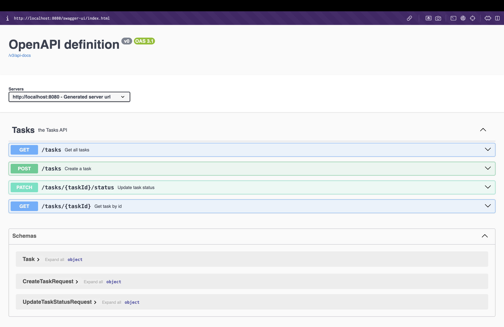

# OpenAPI Contract Sample

## Table of contents

- [What is OpenAPI?](#what-is-openapi)
- [Two parts of this approach](#two-parts-of-this-approach)
    - [1. The specification](#1-the-specification)
    - [2. The generators](#2-the-generators)
- [How it works in this project](#how-it-works-in-this-project)
- [Development flow](#development-flow)
- [How to run](#how-to-run)
- [Swagger UI](#swagger-ui)


This project demonstrates a simple **contract API development** approach using **OpenAPI**, **Spring Boot**, and generated code.

The main idea is:

- the API is defined once in an OpenAPI specification
- the backend **does not define** the API manually in controller signatures
- instead, the backend implements interfaces generated from the OpenAPI contract
- clients can also be generated from the same contract
- Swagger UI can visualize the API and allow interactive testing

This helps teams collaborate better and reduces the risk that backend and client implementations drift apart.

---

## What is OpenAPI?
**OpenAPI** is a standard, language-independent way to describe an HTTP API.

Instead of defining the API only in backend code, you describe it in a machine-readable file, usually YAML or JSON. That file can define:
- available endpoints
- HTTP methods
- parameters
- request bodies
- response bodies
- schemas and data models
- authentication requirements
- API metadata such as title and version 

In this project, the OpenAPI file is:

[openapi-contract/src/main/resources/openapi.yaml](openapi-contract/src/main/resources/openapi.yaml)

This file is the **source of truth** for the API.

- [OpenAPI Specification](https://spec.openapis.org/oas/)
- [OpenAPI Generator](https://openapi-generator.tech/)
- [Available OpenAPI Generators](https://openapi-generator.tech/docs/generators/)


---

## Two parts of this approach

This project is based on two main parts:

### 1. The specification

The specification is the API contract itself.

In this project, that contract is defined in `openapi.yaml`. It describes the API in a language-independent way:
- endpoints
- requests
- responses
- schemas

### 2. The generators

Generators are tools that read the OpenAPI specification and create code for a specific language or framework.

For example:
- Spring generator for a Java / Spring Boot backend
- Java generator for a Java client
- Kotlin generator for a Kotlin client

So the idea is simple:

- **the spec defines the API**
- **the generator turns that spec into code**

---

## How it works in this project

This project uses OpenAPI in a **contract-first** way.

The backend uses the **OpenAPI Generator Maven plugin** with the **Spring generator** to generate Java interfaces and models from `openapi.yaml`.

So in this project:

- the OpenAPI file defines the API contract
- the Spring generator creates interfaces and models
- the handwritten Spring Boot code implements the generated interface
- Swagger UI visualizes the resulting API

This means the backend does not define the API manually first.  
Instead, it implements the API described in OpenAPI.

The exact generator configuration can be found in the backend POM file: [backend-spring/pom.xml](backend-spring/pom.xml)

```yaml
<plugin>
    <groupId>org.openapitools</groupId>
    <artifactId>openapi-generator-maven-plugin</artifactId>
    <version>${openapi.generator.version}</version>
    <executions>
        <execution>
            <id>generate-spring-api</id>
            <phase>generate-sources</phase>
            <goals>
                <goal>generate</goal>
            </goals>
            <configuration>
                <!-- For simplicity, this sample references the OpenAPI spec directly from the contract module. -->
                <!-- In a larger setup, the spec could be packaged as a separate artifact -->
                <!-- (for example, org.example:openapi-contract) and consumed from that dependency instead. -->
                <inputSpec>${project.parent.basedir}/openapi-contract/src/main/resources/openapi.yaml</inputSpec>
                <generatorName>spring</generatorName>

                <apiPackage>org.example.generated.api</apiPackage>
                <modelPackage>org.example.generated.model</modelPackage>
                <invokerPackage>org.example.generated.invoker</invokerPackage>

                <generateApiTests>false</generateApiTests>
                <generateModelTests>false</generateModelTests>
                <generateApiDocumentation>false</generateApiDocumentation>
                <generateModelDocumentation>false</generateModelDocumentation>

                <configOptions>
                    <interfaceOnly>true</interfaceOnly>
                    <useSpringBoot3>true</useSpringBoot3>
                    <delegatePattern>false</delegatePattern>
                    <useTags>true</useTags>
                    <dateLibrary>java8</dateLibrary>
                </configOptions>
            </configuration>
        </execution>
    </executions>
</plugin>
```

---

## Development flow

A simple workflow for this project is:

1. define or update the API in `openapi.yaml`
2. generate code from the contract
3. implement the generated server interface
4. run the application
5. inspect and test the API using Swagger UI

---

## How to run

From the root project directory:

```bash
mvn clean install
mvn -pl backend-spring spring-boot:run
```

---

## Swagger UI

This project also enables Swagger UI so the API can be explored visually in the browser.

Typical URLs:
- OpenAPI JSON: http://localhost:8080/v3/api-docs
- Swagger UI: http://localhost:8080/swagger-ui/index.html



